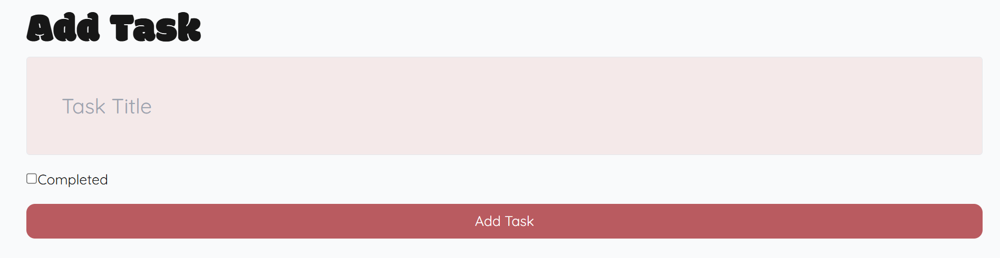

# To-Do Application

This is a to-do application built with [Next.js](https://nextjs.org) and [Tailwind CSS](https://tailwindcss.com). It uses Redux Toolkit for state management and provides a simple interface to add, edit, and manage tasks efficiently.

## Features

- Add new tasks with a clean UI.
- Edit existing tasks to update details.
- Delete tasks when completed or no longer needed.
- Persistent state management using Redux Toolkit.
- Responsive and optimized design using Tailwind CSS.
- Modular file structure for scalability.

## Getting Started

Follow the instructions below to set up and run the application locally.

### Prerequisites

Ensure you have the following installed:
- [Node.js](https://nodejs.org/) (v18 or above recommended)
- [Yarn](https://yarnpkg.com/)

### Installation

1. Clone the repository:
   ```bash
   git clone https://github.com/navya-dhawde/to-do.git
   cd to-do
   ```
2. Install dependencies:
   ```bash
   yarn install
   ```
3. Start the development server:
   ```bash
   yarn dev
   ```
4. Open the app in your browser at (http://localhost:3000).

## Technologies Used

- **Framework**: [Next.js](https://nextjs.org)
- **Styling**: [Tailwind CSS](https://tailwindcss.com)
- **State Management**: [Redux Toolkit](https://redux-toolkit.js.org)
- **Language**: [TypeScript](https://www.typescriptlang.org)

## Scripts

Below are the available scripts for this project:

- **Run Development Server**:
  ```bash
  yarn dev
  ```
## Screenshots
### HomePage

*This is the first screenshot showing the main dashboard. Here is where all the tasks are listed and we have also included a dummy button to add any new task.*

### Add Task

*This screenshot shows the interface where we can add a new task to our to-do list.*

### Edit Task

*Here is a screenshot of the interface where we can edit an existing task from our to-do list.*

## Assumptions

- **Add Task**: The "Add Task" button doesn't actually add and store tasks. It only simulates the behavior by interacting with a dummy API.
- **Edit Task**: The task editing functionality doesn't update the actual task data persistently. It modifies tasks fetched from the dummy API.
- **Task Data**: All tasks are fetched from the [JSONPlaceholder API](https://jsonplaceholder.typicode.com/todos). The application simulates adding, editing, and deleting tasks but doesn't persist these changes to a backend. In a real application, these operations would be connected to a database.

